Track Tab | Entering Water Log | Health | Visualize Tab 
--|--|--|--
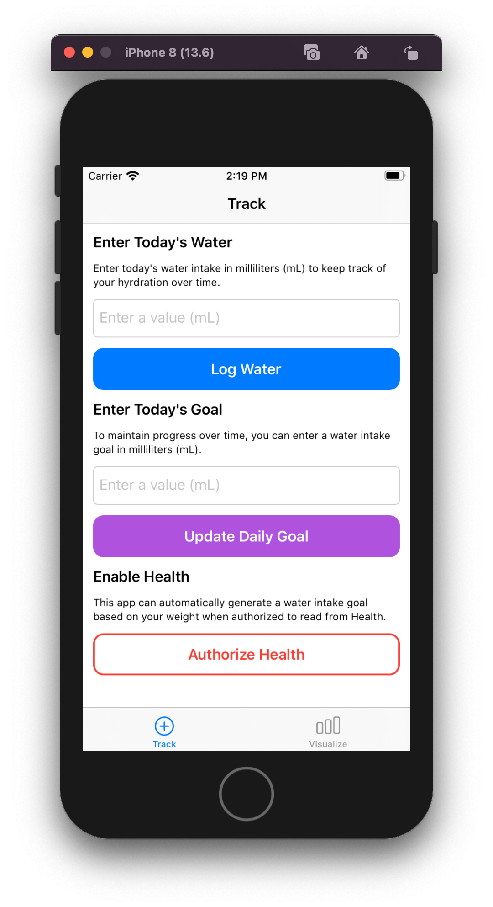||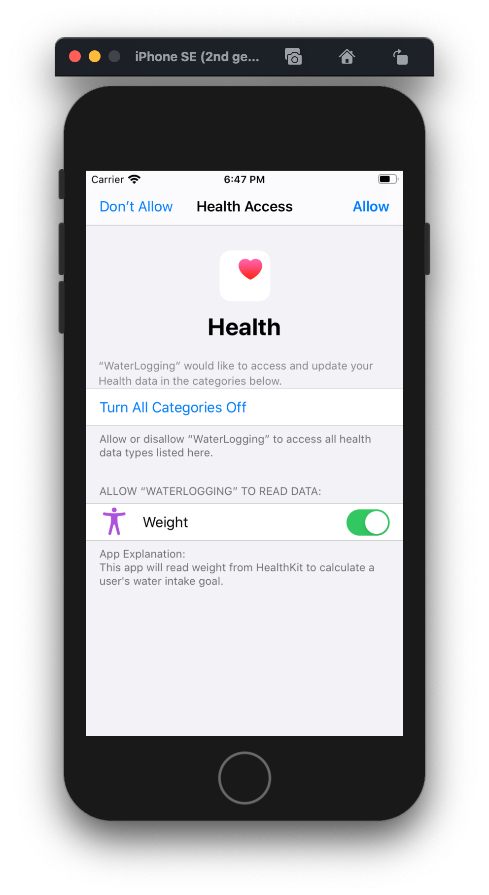|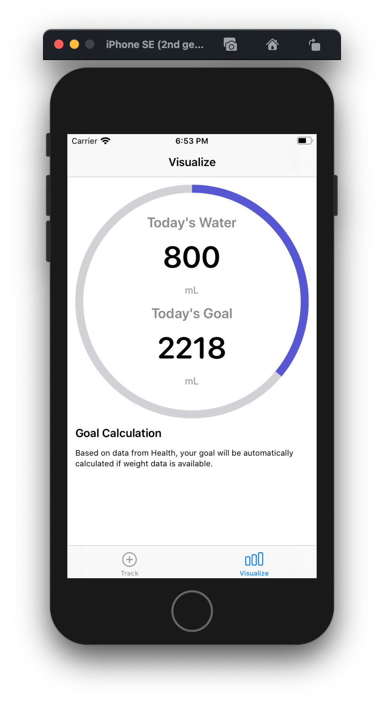

# Project Name:
WaterLogging

# Contributors:
Kyle Ryan

# Dependencies:
- Foundation
- UIKit
- CoreData
- HealthKit
- [Quick/Nimble](https://github.com/Quick/Nimble) (Uses Cocoapods to be installed locally)

# Background:

WaterLogging is an iOS app that allows you to track your water consumption for the day, set water consumption goals, and to see your progress for today. It also uses HealthKit to read a user’s weight to set a rule-of-thumb water consumption goal. 

The project was expanded from the provided base Xcode project template in the interview prompt. For unit tests, I am most familiar with Quick and Nimble. You can find instructions how to run the project and tests below.

These are the choices I made regarding the minimum functionality and the one enhancement. 

- Track today's water intake
- Display the total water intake compared to the goal for the day
- Calculate water intake goals based on the user's weight (read from HealthKit). This goal and progress should update when the user's weight updates.

**Entering Water Consumption**

When you open the app, you can use the first tab to log an amount of water in milliliters (mL). The maximum amount of water you can intake at any one time must be less than or equal to 6000mL. The amount logged must also be greater than 0 mL. 

Enter Water | Type an Amount | Success | Failure 
--|--|--|--
||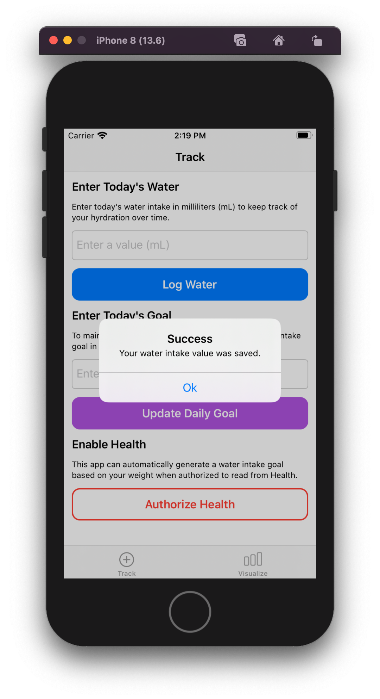|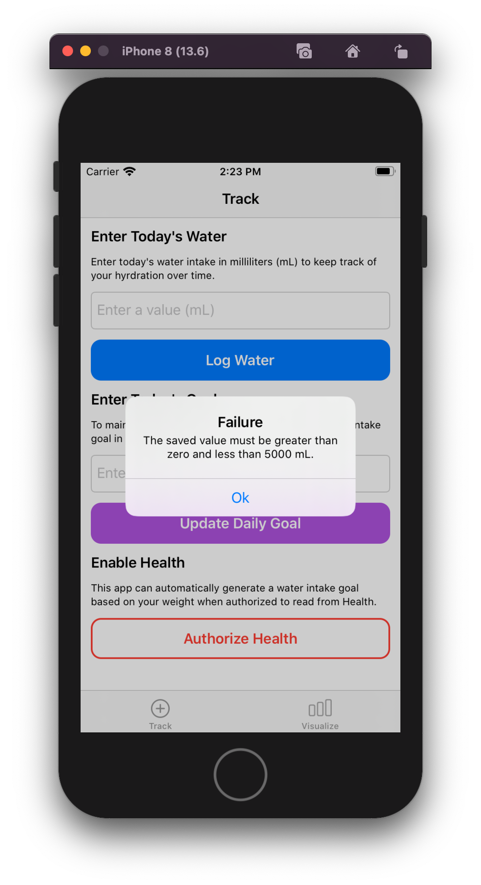

**Setting a Water Consumption Goal**

Enter Goal | Type Goal Amount | Success | See New Goal 
--|--|--|--
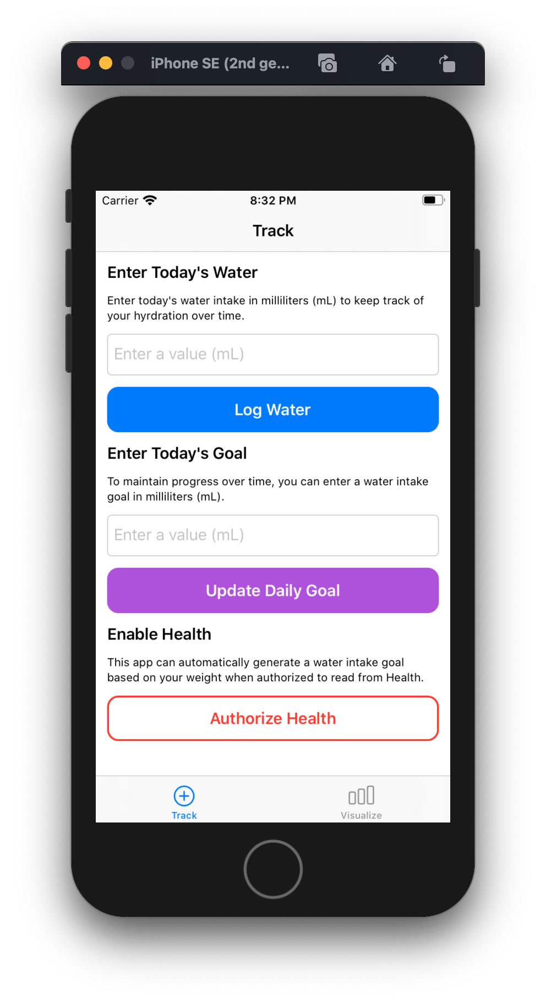|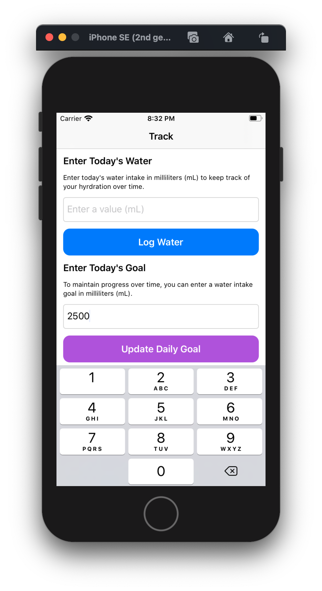|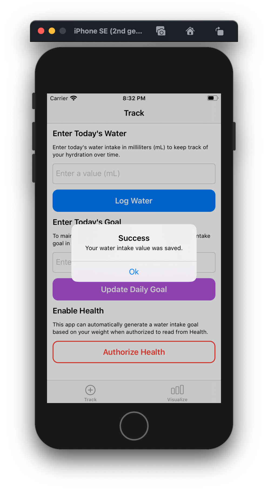|

In the second section, you can enter a daily goal for water consumption. If you have no goal set, your default goal will be 2500 mL. If you have authorized Health, and if your Health record contains a weight, an automatic goal will be calculated. Auto-generated goals will override any manual goals.

**Authorizing Health (Enhancement Choice)**

Authorize Health | Permissions Options | Permissions Accept | See Auto-Generated Goal 
--|--|--|--
|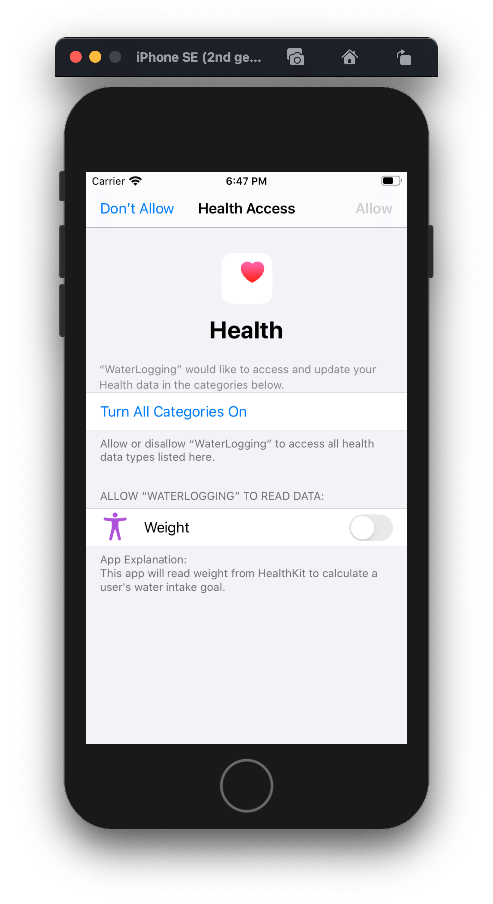||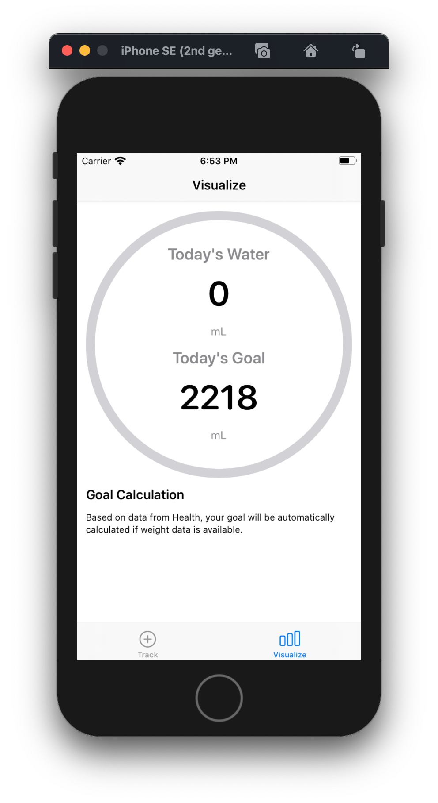|

For users who want to auto-generate water consumption goals, the app can read a user’s weight from Health. If users have multiple weights logged to Health, this app will use the most recent weight reading. If no weight data is available from Health, it will default to the user’s manual goal. If the user does not have a manual goal, it will use the default goal of 6000mL.

**Understanding the Visualization**

No progress | Some Progress | Goal Reached
--|--|--
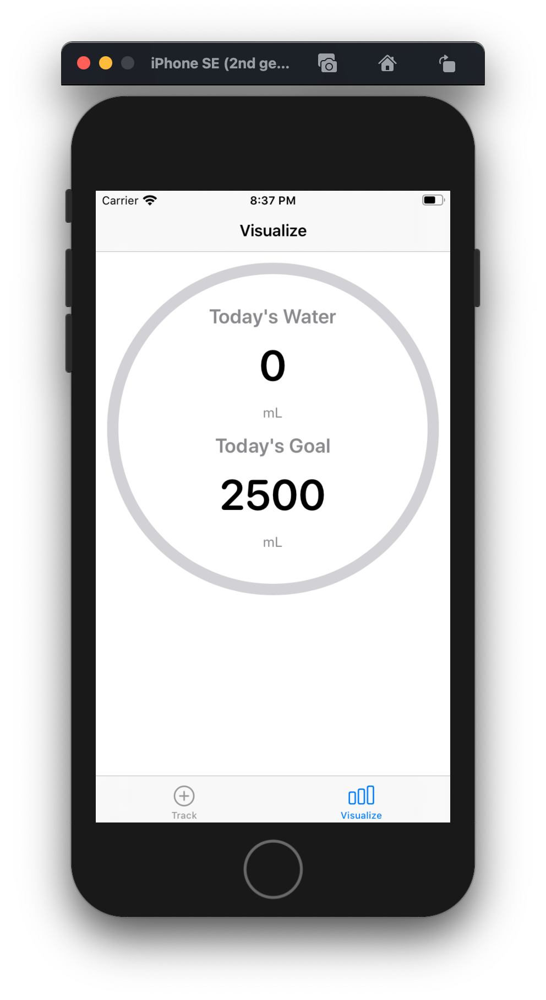|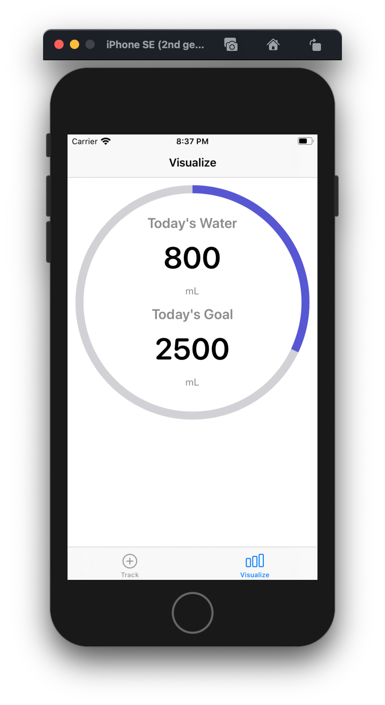|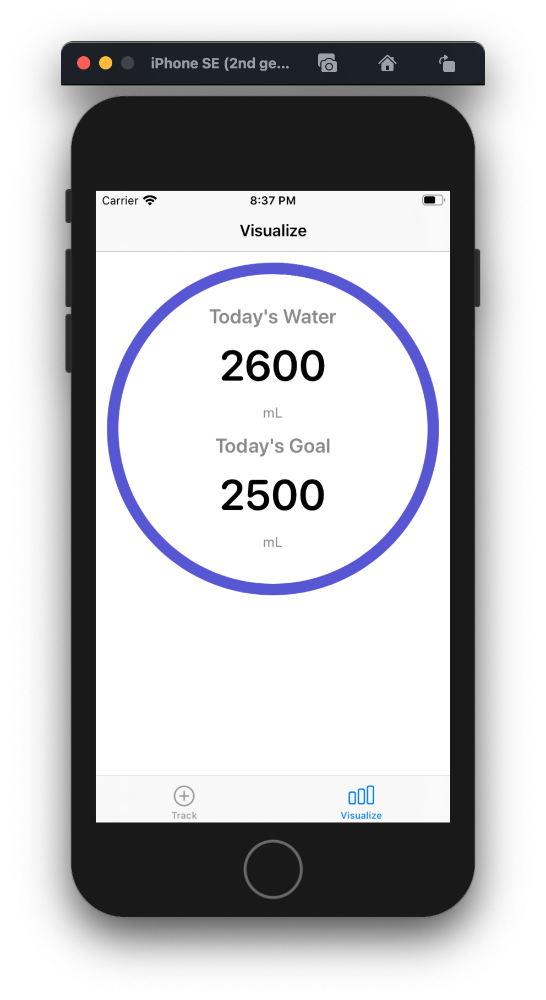

When water consumption is logged, the Visualize tab will update with the progress for the day. The large ring will display a percentage of progress given your progress over today’s goal. The first label will display the progress towards your goal. The second label will display your goal for today.

# Solution:

**Entering Water Consumption**

Water consumption is stored using a single Core Data instance (`WaterLoggingDataModel.xcdatamodel`) with a single NSManagedObject entity called `WaterLogRecord`. The interface for `WaterLogRecord` is auto-generated using Xcode’s codegen. 

I chose to store today’s water consumption in Core Data because it is built-in, fast, and allows for extensibility. If we want to store months or years of water consumption records, Core Data would be the most efficient for many records. 

**Setting a Water Consumption Goal**

For water consumption goals, I did not need a complex database. In this case, I used a User Defaults store called `WaterGoalsStorage` which is a wrapper interface over User Defaults. I made a trade-off to only store the current goal. We have no knowledge of past goals or how goals change over time. 

Upon entering a new water goal in the text field, the value is stored to User Defaults. For auto-generated goals, I also use `WaterGoalsStorage` to make sure the goal persists across sessions. I chose User Defaults for this use-case because it is lightweight, provides a persistence, and has low overhead costs. 

**Health Querying (Enhancement Choice)**

For water consumption goals, we can calculate an auto-generated goal using a user’s last weight record in Health. On the first tab, you can authorize Health to read a user’s weight. If they agree to read weight, I store a default value to remember if we have already shown the prompt. This prevents us from making a subsequent request to authorize from Health. After the first prompt for permission, users have to go to their device’s Health Settings > Health. In this case, I can show an error alert if they try to authorize Health twice and direct them to Settings > Health. 

I chose to only query a single record instead of the entire history of a user’s weight. This was a trade-off because I only am concerned with the user’s last recorded weight. 

If I continued working on the app, I would have better onboarding for Health permissions. I would also display a visual representation to the user if they have already accepted Health permission. 

**Goal Generation**

After some research, I concluded that there’s no accurate way to calculate water consumption using only weight. I opted for a rule-of-thumb calculation based on an article referenced below. This rule-of-thumb calculation has us divide the user’s weight (lbs) in half to determine a water consumption goal in ounces. I then need to convert this calculation to milliliters (mL) to store it in the `WaterGoalsStorage`.

To calculate water goals, I created `WaterGoalGenerator` which has a dependency of `HealthQueryGenerator`. I wanted to create an abstraction of top of the health query generator to ensure my UI code did not have to directly interface with HealthKit. When `generateWaterGoal` is called, it will make an asynchronous call to HealthKit for the user’s last weight and save a calculated goal

When the `VisualizeWaterIntakeViewController` appears, I make a request to calculate the new goal. I do this each time the visualize tab appears. The query code will only execute if the user has authorized HealthKit. I would like to reduce the number of calls to HealthKit by limiting the amount of time we recalculate a new goal based on weight.

**Rendering a Visualization**

After health authorization occurs, I use `NotificationCenter` to trigger a refresh to a new goal calculation based on the user’s weight. This allows us to create a new goal even if the `viewDidAppear` on the visualization tab is not called. 

In general, I make a call to calculate a new goal from Health weight data each time the visualization tab appears. While the goal generation is not expensive, I would like to optimize the number of times we have to generate new goals in a future iteration. 

The visualization contains two text labels for today’s progress and the goal for today. I created a `CircleProgressView` backed by a `CircularProgressViewModel` to do a simple ring style progress view. It uses a percentage (0-1) based on today’s progress divided by the goal for today. 

# Testing:

1. Clone the following repository. https://github.com/deskofkyle/WaterLogging
2. Navigate to the directory that you cloned to. Run `open WaterLogging/WaterLogging.xcworkspace` with Xcode installed. You can also just run the Xcode project. Be sure to run the workspace and not the project. 
3. Choose “WaterLogging” in the schemes and choose a device to run it on.
4. Run through the Validation of Behavior steps below

# How to Run Unit Tests:
1. Clone the following repository. https://github.com/deskofkyle/WaterLogging
2. Navigate to the directory that you cloned to. Run `open WaterLogging/WaterLogging.xcworkspace` with Xcode installed. You can also just run the Xcode project. Be sure to run the workspace and not the project. 
3. Choose “WaterLogging” in the schemes and choose a device to run it on.
4. Press “CMD+U” on your keyboard to run the test target. You can also use “Product > Test” in the Xcode navigation bar. 
5. See tests pass

# Validation of Behavior:
**Track today's water intake**

1. Open the app
2. Go to the Track Tab
3. Under the “Enter Today’s Water” section, use the text field to type in a value. The value must be greater than 0mL and less than 6000mL. 
4. After entering the value, see a success prompt. 
5. Go to the Visualize tab. 
6. Under “Today’s Water”, you should see the value you just entered. 
7. Under “Today’s Goal”, you should see a default goal of 2500mL. 

**Display the total water intake compared to the goal for the day**

1. Open the app
2. Go to the Track Tab
3. Under the “Enter Today’s Goal” section, use the text field to type in a value. The value must be greater than 0mL and less than 6000mL. If you do not do this step, your goal will default to 2500mL.  
4. After entering the goal value, see a success prompt. 
5. Go to the Visualize tab. 
6. Under “Today’s Water”, you should see a sum of the water consumption for today. 
7. Under “Today’s Goal”, you should see the goal you just entered. If not, it will display a default goal of 2500mL.

**Calculate water intake goals based on the user's weight (read from HealthKit). This goal and progress should update when the user's weight updates.**

1. Enter a weight record into Health. (Make note of the most recent weight)
2. Open the app
3. Go to the Track Tab
4. Click “Authorize Health” under “Enable Health” section. 
5. See the HealthKit authorization page with Weight permission listed. 
6. Click “Weight” to enabled using the switch. 
7. Go to the Visualize tab. 
8. See an auto-generated goal under “Today’s Goal” if you have a weight entered into Health. To ensure this goal is accurate, you can convert it from milliliters to ounces. Multiplying the ounces by two will reveal your original weight. 
9. The progress ring will auto-update. 
10. You can enter a new weight into Health. 
11. When the visualization tab next appears, it will make another request to HealthKit to calculate the new goal. 

# Architecture Decisions / Trade-Offs:
**Dependency Injection:**

- I made a single dependency injection class called `MainDependencyContainer`. Each object in the project provides its own factory method. Main Dependency Container then provides an abstract interface of the object to hide the concrete initialization of the object. 
- Even for small projects, dependency injection helps me understand the dependency graph of the project’s classes. In this case, I did not want to over-engineer dependency injection with any complex resolution techniques. I simply wanted to have all the dependency definitions in a single place. 

**Protocol Oriented Objects:**

I made pretty heavy use of protocol-oriented classes. You will notice the dependency container returns protocols instead of the concrete class. This technique serves two purposes: 1) I can define the interface for an object relatively easily. A protocol can expose the properties and methods that a public (internal) class can have access to two. 2) It makes unit testing easier through the ability to create mock objects using separate objects that conform to the protocol. 

**Core Data for Water Logging Persistence:**

As mentioned, I did not want to over-engineer the data persistence layer. I chose to store today’s water consumption in Core Data because it is built-in, fast, and allows for extensibility. If we want to store months or years of water consumption records, Core Data would be the most efficient for many records if we continued working on this application. 

**User Defaults for Goals Persistence:**

I made a trade-off to not store historical goals data. I only need a reference to the current goal to calculate today’s water consumption progress. Since I wanted to persist the goal across sessions, User Defaults was the simplest approach. If I want to expand on goals functionality, I would probably consider a different mechanism like another Core Data entity to show historical goals data. 

**MVVM/MVC:**

Most of the app takes an MVC approach; I separate the models, views, and controllers. For the UI-heavy components, I took a more MVVM approach. MVVM (especially for the goal visualization) allows me to separate the data that powers the view from the view itself. I am also heavily influenced by the notion of a “Worker” object – HealthQueryGenerator, WaterGoalGenerator, WaterLogStorage. These worker objects offload the base implementation into an abstract interface that is easier to work with. These worker objects exist in-between the Model and the Controller layer. 

**UIStackView and Programmatic Autolayout**

For clarity during development, I opted to use UIStackView. I chose this option because it allows for interface flexibility. If I wanted to change the ordering of the sections, a UIStackView would be ideal. Since this app does not have a scroll view, a UIStackView works well. If I did need to add scrolling. I would opt for a UICollectionView or UITableView if I needed to display a long list of information. 
I chose programmatic auto-layout to demonstrate how constraints are added and removed. I did not use XIBs here since programmatic auto-layout provides better readability over the UI’s structure. I also did not use Storyboards, since there was not much navigation involved. 

**Class vs. Struct**

You will notice a mixed-use of Struct and Class for objects in the project. The main decision here was to use Classes for objects that need to hold “state”. If the object did not need to hold state, a struct was preferred since it provides better immutability. 

# Limitations:

- **Timezones:** I chose a time-zone independent approach to data storage. All records are based on the beginning of the day until now using the device’s local timezone. 

- **Unit of Measurement:** I chose to only store representation in milliliters (mL). Other units of measurement could be supported in the future, but I wanted the database to only handle a single unit of measurement type for all records to prevent confusion. 

- **Loading Persistent Store:** In production applications, loading the persistent store from CoreData could fail for a variety of reasons (like no memory on device). In this app, I do not handle failure of loading the persistent store.

- **HealthKit Authorization Status:** As mentioned, I only request HealthKit authorization once. If the user manually turns off Health authorization for weight in iPhone settings, I could only handle that case on the query side. If I had more time, better displaying the health kit authorization status would be a plus. 

- **Max Weight:** Potentially, the auto-generated goals could calculate a goal that is beyond the maximum goal of (6000mL) if a user’s weight is high enough. I would like to more gracefully handle max weight in a future update. 

- **Core Data “Sum” Optimization:** Using CoreData, I fetch all records for the last day. I then run a `reduce` function on the results of the Core Data fetch to calculate the sum of amounts for this day. While I could perform a more efficient query to calculate the sum directly from the Core Data query (like using an NSExpression), I opted to just use a reduce function. 

- **Detecting “New” Weight Entries:** Automatically detecting new weight in HealthKit would be accomplished through HKObserverQueries and HKAnchoredObjectQueries. I used this approach at Strava, but in this example app, we have to perform a new query to HealthKit each time the visualization loads. Detecting new weight entries and only updating the goal when weight changes would be a nice optimization. 

# Citations:

The following list contains all of the references I used during the development of the app. If you are looking for a particular citation, please use Xcode’s Global Find tab. Pasting the reference hyperlink will reveal the functions or classes it is used in. 

**Title:** Origins for the estimations of water requirements in adults
**Description:** I looked up some research about proper water consumption goals. Since there’s no empirical way to calculate water consumption using only weight, I opted for a rule-of-thumb calculation. 
**Link:** https://www.nature.com/articles/ejcn2012157

**Title:** How to calculate how much water you should drink
**Description:** This blog post suggested a basic rule-of-thumb calculation for water consumption.
**Link:** https://www.umsystem.edu/totalrewards/wellness/how-to-calculate-how-much-water-you-should-drink

**Title:** How to use SF Rounded Typeface=
**Description:** I wanted to use the SF Rounded Typeface for the visual display of the progress goals. The extension is my app is influenced by the technique described in the cited link.
**Link:** https://stackoverflow.com/a/57961002

# Xcode and Swift Version:
Version 11.6 (11E708)
Swift 5
Minimum Deployment Target: 13.0
